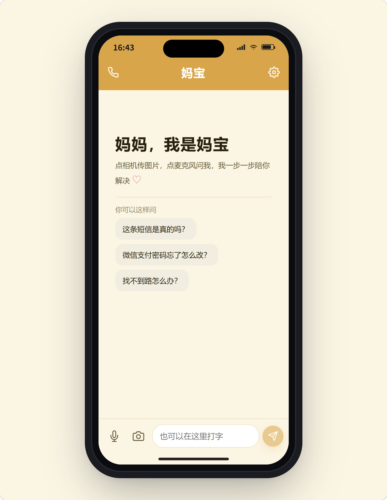
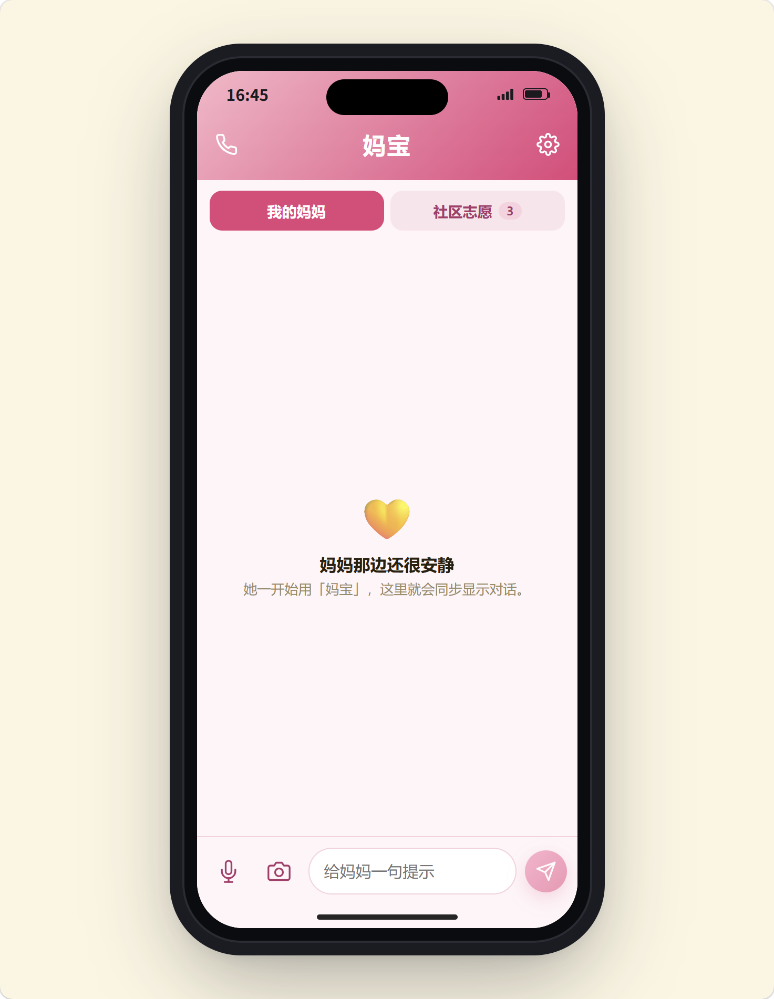
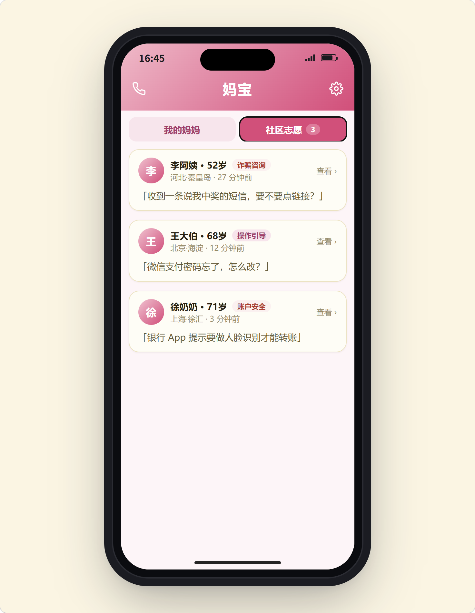

# 妈宝 Side By Side

这是一个双端联动的演示项目，核心目标是帮助不熟悉智能手机的妈妈处理复杂页面操作。


## 界面截图

| 妈妈端 | 妈妈端 |
| --- | --- |
|  |  |

| 女儿端 | 女儿端 |
| --- | --- |
|  |  |

## 主要功能

- 双端联动聊天: 妈妈、女儿和AI在同一群聊
- 妈妈端输入方式: 打字、语音转文字、上传图片/视频
- 妈妈端语音播报: 浏览器 TTS 自动播报 AI 回复
- 女儿端能力: 给妈妈发消息、查看社区志愿求助、接单与电话回拨
- AI 风险分级: none / daughter / volunteer

## 项目架构

项目采用 Monorepo 结构，前端与服务端分离:

- frontend: React + Vite + TypeScript
- server: Express + TypeScript + Azure OpenAI


```text
SideBySide/
├── README.md
├── DESIGN.md
├── DEPLOY.md
├── package.json
├── frontend/
│   ├── package.json
│   └── src/
│       ├── App.tsx
│       ├── main.tsx
│       ├── styles.css
│       ├── pages/
│       │   └── Daughter.tsx
│       └── lib/
│           ├── api.ts
│           ├── bus.ts
│           ├── mockImages.ts
│           └── types.ts
└── server/
    ├── package.json
    └── src/
        ├── server.ts
        ├── openai.ts
        ├── prompt.ts
        ├── store.ts
        └── types.ts
```

## 本地开发

```powershell
# 前提：Node.js 20+，npm 10+

# 进入项目根目录
cd C:\Users\<user_name>\Downloads\SideBySide

# 安装依赖
npm install

# 启动前端开发服务（Vite）
npm run dev:frontend

# 启动服务端开发服务（Express + tsx watch）
npm run dev:server
```

默认地址:

- 妈妈端：http://localhost:5173/mom
- 女儿端：http://localhost:5173/daughter
- 测试端：http://localhost:5173/mom/debug

## 构建与运行

```powershell
# 全量构建前端与服务端
npm run build

# 以生产方式启动服务端
npm run start
```

## 环境变量

```env
# Azure OpenAI 服务地址
AZURE_OPENAI_ENDPOINT=

# Azure OpenAI API Key
AZURE_OPENAI_API_KEY=

# Azure OpenAI API 版本
AZURE_OPENAI_API_VERSION=2024-08-01-preview

# 是否启用 mock 模式（true 为 mock，false 为真实 AI）
USE_MOCK_AI=false
```


## 部署

Azure App Service 部署步骤见 `DEPLOY.md`。

当前线上流程是:

1. 本地 build
2. 组装 `deploy.zip`
3. 上传到 Kudu `/home/deploy.zip`
4. SSH 解压到 `/home/site/wwwroot`
5. 重启站点

## 已知限制

- 前端仍保留 guidanceImageUrl 渲染逻辑，主要用于 /mom/debug 演示
- 会话存储为内存 Map，服务重启会丢失
- 语音输入依赖浏览器 SpeechRecognition，部分 iOS 环境不可用
- TTS 依赖浏览器 speechSynthesis，实际音色随设备变化
